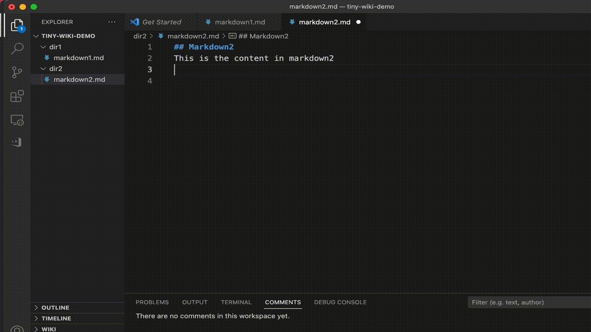

# tiny-wiki

A **simple** yet powerful wiki/note-taking extension for vscode.



## Features
- Helps to **link** your notes(markdown documents) together. To refer to another markdown document in your current one, just type:
```markdown
[[filename-of-another-note]]
```

- Autocomplete the name of the markdown filename. Typing inside `[[]]` will trigger the wiki autocomplete:


- Autocomplete image resource. Typing between `` will trigger the resource autocomplete:

